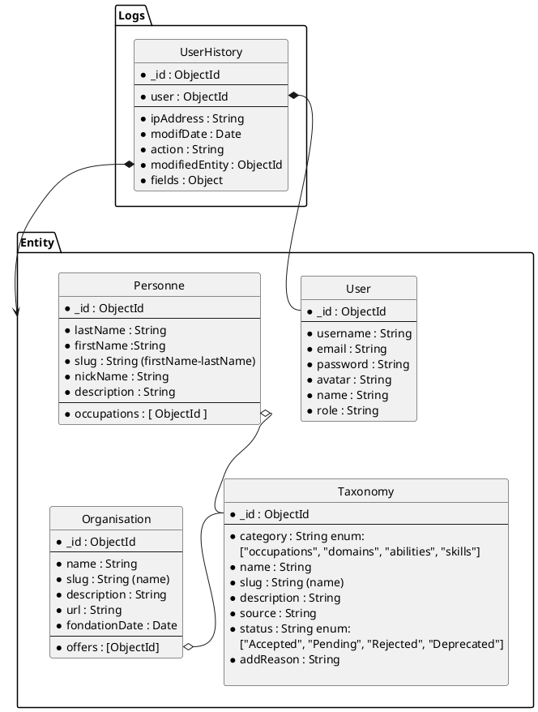
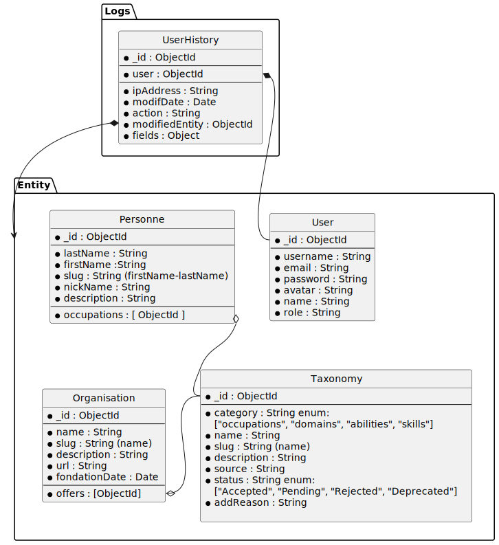

# Base de données

## Schema actuel de la bd

```plantuml:bdsol-uml
@startuml
'Syntax doc
' https://plantuml.com/guide

'VsCode download extension (PlantUML) --> Alt-D

'Format
' hide the spot
hide circle
'skinparam linetype polyline

package Entity {
  entity "Personne" as pers {
    *_id : ObjectId
    --
    *lastName : String
    *firstName :String
    *slug : String (firstName-lastName)
    *nickName : String
    *description : String
    --
    *occupations : [ ObjectId ]
  }

  entity "Taxonomy" as taxo {
    *_id : ObjectId
    --
    *category : String enum:
    ["occupations", "domains", "abilities", "skills"]
    *name : String
    *slug : String (name)
    *description : String
    *source : String
    *status : String enum:
      ["Accepted", "Pending", "Rejected", "Deprecated"]
    *addReason : String

  }

  entity "Organisation" as org {
    *_id : ObjectId
    --
    *name : String
    *slug : String (name)
    *description : String
    *url : String
    *fondationDate : Date
    --
    *offers : [ObjectId]
  }


  entity "User" as usr {
    *_id : ObjectId
    --
    *username : String
    *email : String
    *password : String
    *avatar : String
    *name : String
    *role : String
  }
}
package Logs {
  entity "UserHistory" as usrhst {
    *_id : ObjectId
    --
    *user : ObjectId
    --
    *ipAddress : String
    *modifDate : Date
    *action : String
    *modifiedEntity : ObjectId
    *fields : Object
  }
}

'relations
pers::occupations o-r- taxo::_id
org::offers o-r- taxo::_id
usrhst::user *-- usr::_id
usrhst::modifiedEntity *-l-> Entity

'Invisible links (format)
pers -[hidden]d- org
pers -[hidden]r- usr

@enduml
```
