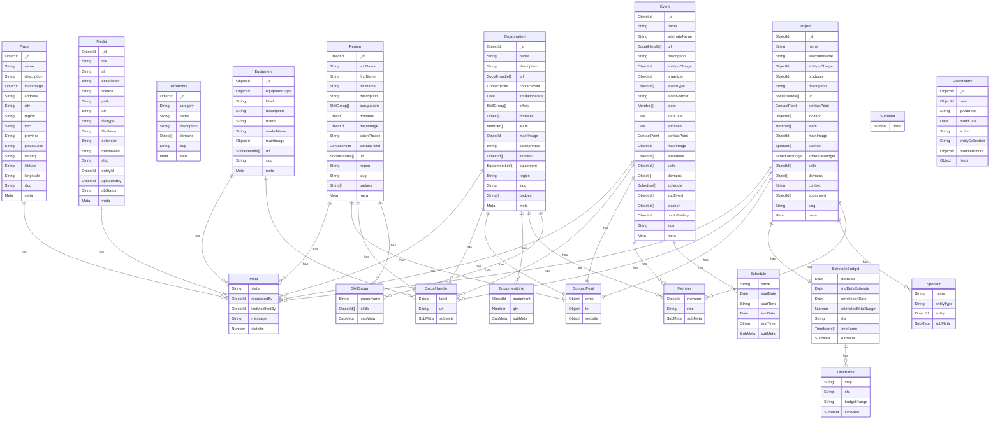

# Base de données

## Schema actuel de la bd

```mermaid
erDiagram
    %% Entity Package
    Person {
        ObjectId _id
        String lastName
        String firstName
        String nickname
        String description
        SkillGroup[] occupations
        Object[] domains
        ObjectId mainImage
        String catchPhrase
        ContactPoint contactPoint
        SocialHandle[] url
        String region
        String slug
        String[] badges
        Meta meta
    }

    Organisation {
        ObjectId _id
        String name
        String description
        SocialHandle[] url
        ContactPoint contactPoint
        Date fondationDate
        SkillGroup[] offers
        Object[] domains
        Member[] team
        ObjectId mainImage
        String catchphrase
        ObjectId[] location
        EquipmentLink[] equipment
        String region
        String slug
        String[] badges
        Meta meta
    }

    Taxonomy {
        ObjectId _id
        String category
        String name
        String description
        Object[] domains
        String slug
        Meta meta
    }

    Project {
        ObjectId _id
        String name
        String alternateName
        ObjectId entityInCharge
        ObjectId producer
        String description
        SocialHandle[] url
        ContactPoint contactPoint
        ObjectId[] location
        Member[] team
        ObjectId mainImage
        Sponsor[] sponsor
        ScheduleBudget scheduleBudget
        ObjectId[] skills
        Object[] domains
        String context
        ObjectId[] equipment
        String slug
        Meta meta
    }

    Event {
        ObjectId _id
        String name
        String alternateName
        SocialHandle[] url
        String description
        ObjectId entityInCharge 
        ObjectId organizer
        ObjectId[] eventType
        String eventFormat
        Member[] team
        Date startDate
        Date endDate
        ContactPoint contactPoint
        ObjectId mainImage
        ObjectId[] attendees
        ObjectId[] skills
        Object[] domains
        Schedule[] schedule
        ObjectId[] subEvent
        ObjectId[] location
        ObjectId photoGallery
        String slug
        Meta meta
    }

    Equipment {
        ObjectId _id
        ObjectId equipmentType
        String label
        String description
        String brand
        String modelName
        ObjectId mainImage
        SocialHandle[] url
        String slug
        Meta meta
    }

    Media {
        ObjectId _id
        String title
        String alt
        String description
        String licence
        String path
        String url
        String fileType
        String fileName
        String extension
        String mediaField
        String slug
        ObjectId entityId
        ObjectId uploadedBy
        String dbStatus
        Meta meta
    }

    Place {
        ObjectId _id
        String name
        String description
        ObjectId mainImage
        String address
        String city
        String region
        String mrc
        String province
        String postalCode
        String country
        String latitude
        String longitude
        String slug
        Meta meta
    }

    %% SubSchema Package
    Meta {
        String state
        ObjectId requestedBy
        ObjectId lastModifiedBy
        String message
        Number statistic
    }

    SubMeta {
        Number order
    }

    SkillGroup {
        String groupName
        ObjectId[] skills
        SubMeta subMeta
    }

    ContactPoint {
        Object email
        Object tel
        Object website
    }

    EquipmentLink {
        ObjectId equipment
        Number qty
        SubMeta subMeta
    }

    Timeframe {
        String step
        String eta
        String budgetRange
        SubMeta subMeta
    }

    ScheduleBudget {
        Date startDate
        Date endDateEstimate
        Date completionDate
        Number estimatedTotalBudget
        String eta
        Timeframe[] timeframe
        SubMeta subMeta
    }

    Schedule {
        String name
        Date startDate
        String startTime
        Date endDate
        String endTime
        SubMeta subMeta
    }

    SocialHandle {
        String label
        String url
        SubMeta subMeta
    }

    Sponsor {
        String name
        String entityType
        ObjectId entity
        SubMeta subMeta
    }

    Member {
        ObjectId member
        String role
        SubMeta subMeta
    }

    %% Logs Package
    UserHistory {
        ObjectId _id
        ObjectId user
        String ipAddress
        Date modifDate
        String action
        String entityCollection
        ObjectId modifiedEntity
        Object fields
    }

    %% Relationships
    Person ||--o{ SkillGroup : "has"
    Person ||--o{ SocialHandle : "has"
    Person ||--|| ContactPoint : "has"
    Person ||--o{ Meta : "has"

    Organisation ||--o{ SkillGroup : "has"
    Organisation ||--o{ Member : "has"
    Organisation ||--o{ EquipmentLink : "has"
    Organisation ||--|| ContactPoint : "has"
    Organisation ||--o{ SocialHandle : "has"
    Organisation ||--o{ Meta : "has"

    Project ||--o{ Member : "has"
    Project ||--o{ Sponsor : "has"
    Project ||--|| ScheduleBudget : "has"
    Project ||--|| ContactPoint : "has"
    Project ||--o{ SocialHandle : "has"
    Project ||--o{ Meta : "has"

    Event ||--o{ Schedule : "has"
    Event ||--o{ Member : "has"
    Event ||--|| ContactPoint : "has"
    Event ||--o{ SocialHandle : "has"
    Event ||--o{ Meta : "has"

    Equipment ||--o{ SocialHandle : "has"
    Equipment ||--o{ Meta : "has"

    Media ||--o{ Meta : "has"

    Place ||--o{ Meta : "has"

    ScheduleBudget ||--o{ Timeframe : "has"
```